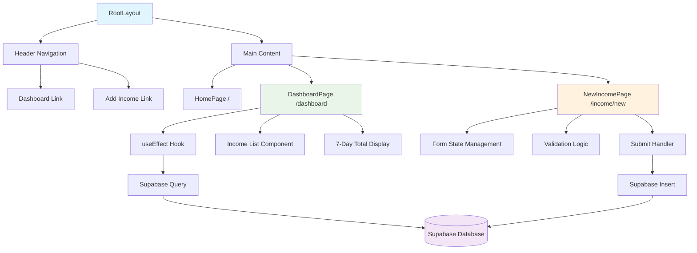
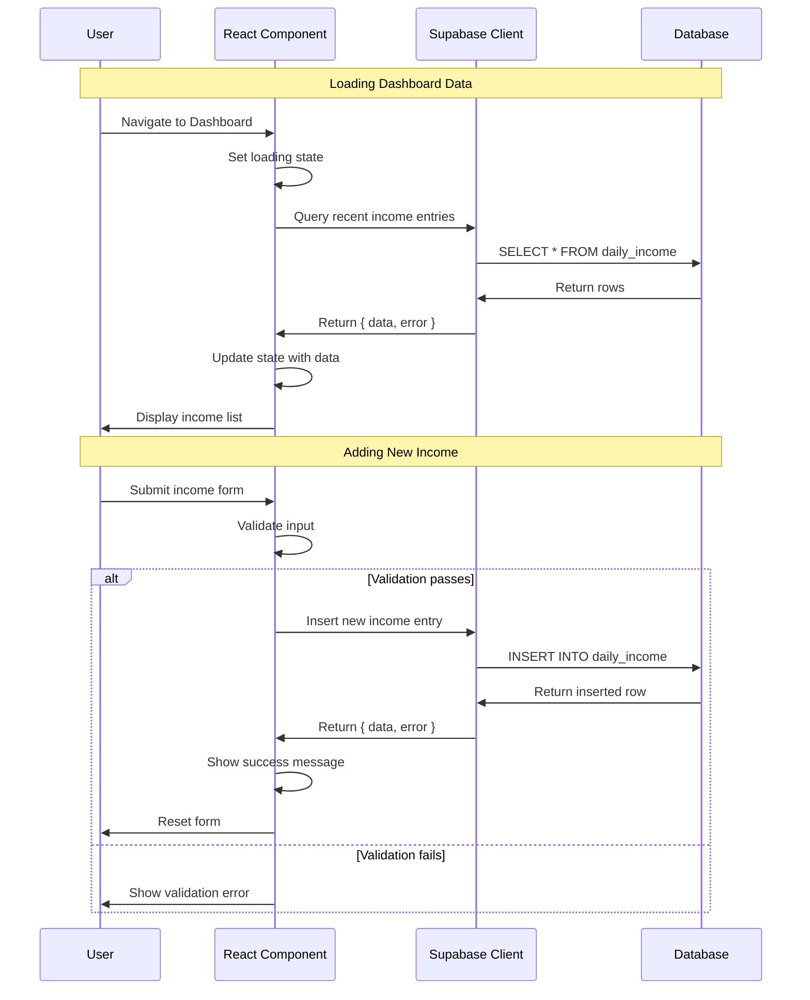
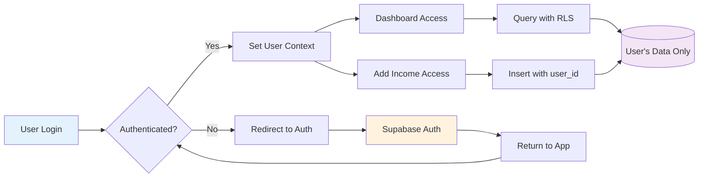
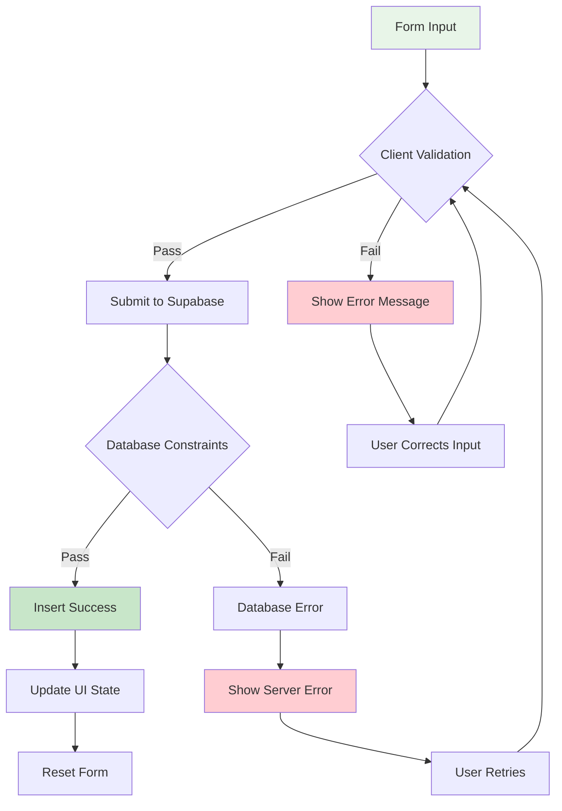

# Merci Tracker Frontend Architecture

## Table of Contents

| Section                                                          | Description                                                      |
| ---------------------------------------------------------------- | ---------------------------------------------------------------- |
| [Project Overview](#project-overview)                            | Application scope, goals, and requirements for income tracking   |
| [Technical Stack & Dependencies](#technical-stack--dependencies) | Current technology choices with justifications                   |
| [Development Approach](#development-approach)                    | Methodology focusing on simplicity and maintainability           |
| [System Architecture](#system-architecture)                      | Frontend architecture including components, state, and data flow |
| [Data Layer Integration](#data-layer-integration)                | Supabase integration patterns and strategies                     |
| [User Experience Patterns](#user-experience-patterns)            | Consistent UX patterns for interactions and navigation           |
| [Testing Strategy](#testing-strategy)                            | Testing approach for application complexity                      |
| [Folder Structure](#folder-structure)                            | Current and recommended project organization                     |
| [Architecture Diagrams](#architecture-diagrams)                  | Visual representations using Mermaid.js                          |

## Project Overview

**Merci Tracker** is a daily income tracking application designed for simplicity and ease of use. The application enables users to record daily income entries, view recent transactions, and monitor weekly totals with Malaysian Ringgit (RM) as the primary currency.

### Core Goals

- **Simplicity**: Minimal cognitive load for daily income tracking
- **Performance**: Fast loading and responsive interactions
- **Reliability**: Consistent data persistence and retrieval
- **Accessibility**: Usable across different devices and user capabilities
- **Maintainability**: Clean, understandable codebase for future development

### Functional Requirements

- Add daily income entries with date, amount, and optional notes
- Display dashboard with recent entries (last 30 records)
- Calculate and show 7-day income totals
- Form validation and error handling
- Responsive design for mobile and desktop use

## Technical Stack & Dependencies

### Core Technologies

#### Next.js 15.5.3 (App Router + Turbopack)

- **Justification**: Modern React framework with excellent performance, built-in routing, and TypeScript support
- **Features Used**: App Router for file-based routing, Turbopack for fast development builds
- **Benefits**: Server-side rendering capabilities, optimal bundling, and future-ready architecture

#### React 19.1.0 with TypeScript

- **Justification**: Latest React with improved concurrent features and built-in TypeScript support
- **Pattern**: Client-side components with hooks for state management
- **Benefits**: Type safety, modern React patterns, excellent developer experience

#### Tailwind CSS v4

- **Justification**: Utility-first CSS framework for rapid UI development
- **Configuration**: PostCSS integration for optimal build process
- **Benefits**: Consistent design system, responsive utilities, minimal CSS bundle size

#### Supabase Client

- **Version**: `@supabase/supabase-js` ^2.57.4
- **Justification**: PostgreSQL-based backend-as-a-service with real-time capabilities
- **Integration**: Direct client calls for simplicity in current scope
- **Benefits**: SQL-based queries, built-in authentication support, real-time subscriptions

### Development Dependencies

- **ESLint**: Code quality and consistency
- **TypeScript**: Type checking and developer experience
- **Node.js Types**: Runtime environment type definitions

## Development Approach

### Principles

1. **Progressive Enhancement**: Start simple, add complexity as needed
2. **Convention over Configuration**: Leverage Next.js and React defaults
3. **Component-First**: Build reusable, focused components
4. **Type Safety First**: Comprehensive TypeScript usage
5. **Mobile-First Responsive**: Design for mobile, enhance for desktop

### Methodology

- **Incremental Development**: Add features one at a time
- **Direct Integration**: Use Supabase client directly until complexity requires abstraction
- **Local State Priority**: Use React state unless global state is clearly needed
- **Validation at Input**: Immediate feedback for user interactions

## System Architecture

### Component Hierarchy

The application follows a simple page-based architecture with shared layout components:

```
RootLayout
├── Header (Navigation)
│   ├── Dashboard Link
│   └── Add Income Link
└── Main Content
    ├── HomePage (/)
    ├── DashboardPage (/dashboard)
    └── NewIncomePage (/income/new)
```

### State Management Strategy

#### Local Component State

- **Form inputs**: Date, amount, notes in NewIncomePage
- **UI states**: Loading, error, success messages
- **Local data**: Dashboard entries, calculations

#### Server State

- **Supabase queries**: Direct database interactions
- **No caching layer**: Fetch fresh data on page load
- **Simple error handling**: Display errors inline

### Data Flow Patterns

1. **User Input → Validation → Supabase → UI Feedback**
2. **Page Load → Supabase Query → Loading State → Data Display**
3. **Form Submit → Client Validation → Database Insert → Success/Error State**

### Form Validation and Error Handling

#### Client-Side Validation

- **Required fields**: Date, amount
- **Type validation**: Number conversion and range checking
- **Format validation**: Date format, decimal precision
- **Immediate feedback**: Error messages on invalid input

#### Error Handling Patterns

```typescript
// Consistent error state management
const [error, setError] = useState<string | null>(null);

// Database operation error handling
if (error) {
  setStatus(`Error: ${error.message}`);
} else {
  setStatus("Saved!");
}
```

### Accessibility Considerations

#### Form Accessibility

- **Semantic HTML**: Proper form labels and input types
- **ARIA attributes**: Where native HTML is insufficient
- **Keyboard navigation**: Tab order and focus management
- **Screen reader support**: Descriptive labels and status messages

#### Visual Design

- **Color contrast**: Adequate contrast ratios for text and backgrounds
- **Responsive typography**: Scalable font sizes
- **Touch targets**: Minimum 44px touch target size
- **Focus indicators**: Visible focus states for interactive elements

### Performance Optimization

#### Bundle Optimization

- **Turbopack**: Fast development builds and optimized production bundles
- **Tree shaking**: Automatic dead code elimination
- **Code splitting**: Page-level chunks with Next.js

#### Runtime Performance

- **Client-side rendering**: For dynamic data and interactions
- **Minimal JavaScript**: Only necessary client-side code
- **Efficient re-renders**: Proper React key usage and state structure

#### Loading Optimization

- **Loading states**: Immediate feedback during data fetching
- **Error boundaries**: Graceful error handling
- **Progressive loading**: Show content as it becomes available

### Browser Compatibility

#### Target Browsers

- **Modern browsers**: Chrome, Firefox, Safari, Edge (last 2 versions)
- **Mobile browsers**: iOS Safari, Chrome Mobile
- **Progressive enhancement**: Basic functionality in older browsers

#### Polyfills and Fallbacks

- **Next.js defaults**: Automatic polyfill inclusion
- **CSS Grid/Flexbox**: Modern layout with fallbacks
- **ES6+ features**: Transpiled by build process

## Data Layer Integration

### Database Schema Considerations

#### Current Table: `daily_income`

```sql
-- Expected schema structure
CREATE TABLE daily_income (
  id UUID PRIMARY KEY DEFAULT gen_random_uuid(),
  date DATE NOT NULL,
  amount DECIMAL(10,2) NOT NULL,
  notes TEXT,
  created_at TIMESTAMP DEFAULT NOW(),
  updated_at TIMESTAMP DEFAULT NOW()
);
```

### Supabase Integration Patterns

#### Query Patterns

```typescript
// Consistent query structure
const { data, error } = await supabase
  .from("daily_income")
  .select("id, date, amount, notes")
  .order("date", { ascending: false })
  .limit(30);
```

#### Insert Patterns

```typescript
// Consistent insert with validation
const { data, error } = await supabase
  .from("daily_income")
  .insert({ date, amount, notes })
  .select()
  .single();
```

### Error Handling for Database Operations

#### Connection Errors

- **Network issues**: Retry logic or user notification
- **Timeout handling**: Graceful degradation
- **Connection status**: Online/offline detection

#### Data Validation Errors

- **Database constraints**: Foreign key, unique constraints
- **Type mismatches**: Proper TypeScript interfaces
- **Required fields**: Server-side validation alignment

#### Authentication Integration Strategy

#### Current State

- **No authentication**: Direct database access (development only)
- **Placeholder comments**: Ready for auth implementation

#### Future Integration

```typescript
// Future authentication pattern
const { data: user } = await supabase.auth.getUser();
const { data, error } = await supabase
  .from("daily_income")
  .insert({ date, amount, notes });
```

## User Experience Patterns

### Form Interactions

#### Input Validation Feedback

- **Immediate validation**: On blur for complex fields
- **Submit validation**: Comprehensive check before submission
- **Success feedback**: Clear confirmation of successful actions
- **Error messaging**: Specific, actionable error descriptions

#### Loading States

```typescript
// Consistent loading pattern
{
  loading && <p>Loading…</p>;
}
{
  error && <p className="text-red-600">Error: {error}</p>;
}
{
  !loading && !error && <DataComponent />;
}
```

#### Form Reset Behavior

- **Successful submission**: Clear amount and notes, keep date
- **Validation errors**: Maintain user input
- **Navigation**: Preserve form state appropriately

### Navigation and Routing

#### Navigation Patterns

- **Consistent header**: Always visible navigation
- **Clear hierarchy**: Home → Dashboard/Add Income
- **Mobile-friendly**: Touch-friendly navigation elements

#### URL Structure

```
/ - Welcome/landing page
/dashboard - Income overview and recent entries
/income/new - Add new income entry
```

### Responsive Design Considerations

#### Breakpoint Strategy

```css
/* Tailwind CSS responsive utilities */
.container {
  @apply max-w-3xl mx-auto p-4; /* Mobile-first */
}

/* Tablet and desktop enhancements */
@media (min-width: 768px) {
  /* Enhanced layouts */
}
```

#### Mobile-First Components

- **Touch-friendly forms**: Large input areas, adequate spacing
- **Readable typography**: Minimum 16px font size
- **Simplified navigation**: Collapsible menus if needed

### Error Message Strategy

#### Error Types and Handling

1. **Validation errors**: Inline, field-specific messages
2. **Network errors**: Global notification with retry options
3. **Server errors**: User-friendly messages with technical details
4. **Not found errors**: Clear navigation options

## Testing Strategy

### Testing Approach for Current Complexity

Given the application's current simplicity, the testing strategy emphasizes:

#### Manual Testing Priority

- **Cross-browser testing**: Major browsers and devices
- **Form validation**: All input scenarios and edge cases
- **Data persistence**: Verify database operations
- **Responsive behavior**: Multiple screen sizes

#### Automated Testing Foundation

```typescript
// Future unit testing structure
describe("Income Form Validation", () => {
  test("rejects negative amounts", () => {
    // Test validation logic
  });

  test("formats currency correctly", () => {
    // Test display formatting
  });
});
```

#### Integration Testing

- **Database operations**: Supabase CRUD operations
- **Form submission flow**: End-to-end user workflows
- **Error handling**: Network failures and edge cases

#### Testing Tools Recommendation

- **Jest**: Unit testing framework
- **React Testing Library**: Component testing
- **Playwright**: End-to-end testing
- **TypeScript**: Compile-time error prevention

## Folder Structure

### Current Structure

```
merci-tracker/
├── src/
│   ├── app/
│   │   ├── layout.tsx          # Root layout with navigation
│   │   ├── page.tsx            # Home/welcome page
│   │   ├── dashboard/
│   │   │   └── page.tsx        # Dashboard with recent entries
│   │   └── income/
│   │       └── new/
│   │           └── page.tsx    # Add income form
│   └── lib/
│       └── supabase.ts         # Supabase client configuration
├── public/                     # Static assets
├── docs/                       # Documentation (this file)
└── [config files]             # Next.js, TypeScript, Tailwind, etc.
```

### Recommended Enhanced Structure

For future scalability without over-engineering:

```
merci-tracker/
├── src/
│   ├── app/                    # Next.js App Router pages
│   │   ├── (auth)/            # Future: Auth-required pages
│   │   │   ├── dashboard/
│   │   │   └── income/
│   │   ├── layout.tsx
│   │   └── page.tsx
│   ├── components/            # Reusable UI components
│   │   ├── forms/
│   │   ├── ui/               # Basic UI primitives
│   │   └── layout/
│   ├── lib/                  # Utilities and integrations
│   │   ├── supabase.ts
│   │   ├── validation.ts     # Form validation schemas
│   │   └── utils.ts          # General utilities
│   ├── types/                # TypeScript type definitions
│   │   └── database.ts       # Supabase generated types
│   └── hooks/                # Custom React hooks
│       └── useIncome.ts      # Income-related data operations
├── docs/                     # Architecture and documentation
└── tests/                    # Test files (future)
    ├── __mocks__/
    ├── components/
    └── pages/
```

### Migration Strategy

#### Immediate Improvements

1. **Extract components**: Form inputs, data tables, navigation
2. **Add validation utilities**: Centralized validation logic
3. **Type definitions**: Supabase type generation
4. **Custom hooks**: Data fetching abstraction

#### Future Enhancements

1. **Authentication routing**: Route groups for protected pages
2. **Component library**: Reusable UI components
3. **Testing infrastructure**: Test utilities and mocks
4. **Documentation**: Component docs and examples

## Architecture Diagrams

### Component Hierarchy and Data Flow



### Supabase Integration Architecture



### Future Authentication Flow



### Data Validation Flow



---

## Implementation Notes

### Immediate Action Items

1. **Component Extraction**: Move repeated UI patterns into reusable components
2. **Type Safety**: Add comprehensive TypeScript interfaces for database operations
3. **Error Boundaries**: Implement React error boundaries for graceful error handling
4. **Loading States**: Standardize loading state patterns across all data operations
5. **Form Validation**: Create reusable validation utilities

### Future Considerations

1. **State Management**: Consider React Query or SWR for server state management as the app grows
2. **Component Library**: Build a design system with consistent spacing, colors, and typography
3. **Testing Infrastructure**: Set up automated testing as features increase
4. **Performance Monitoring**: Add metrics collection for user experience optimization
5. **Internationalization**: Prepare for multiple currency and language support

### Architecture Evolution Path

The current architecture prioritizes simplicity and rapid development. As the application grows, consider these evolution stages:

1. **Current Stage**: Direct Supabase integration with local component state
2. **Enhanced Stage**: Custom hooks for data operations, extracted components
3. **Mature Stage**: Dedicated state management, comprehensive testing, advanced error handling
4. **Scale Stage**: Micro-frontends, advanced performance optimization, extensive monitoring

This architecture document serves as a living guide that should be updated as the application evolves and new requirements emerge.
