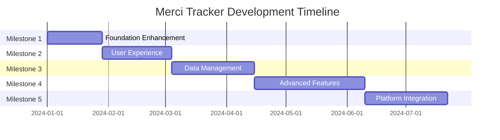

# Merci Tracker - Milestone Development Plan

## Project Timeline Overview

**Total Project Duration**: 6-8 months
**Development Approach**: Iterative milestone-based delivery
**Team Context**: Solo developer or small team (2-3 developers)



## Milestone Summary Table

| Milestone | Name                         | Objective                              | Duration | Priority | Dependencies     |
| --------- | ---------------------------- | -------------------------------------- | -------- | -------- | ---------------- |
| 1         | Foundation Enhancement       | Code quality, testing, and performance | 4 weeks  | Critical | Current codebase |
| 2         | User Experience Improvements | Enhanced UX and mobile responsiveness  | 5 weeks  | High     | Milestone 1      |
| 3         | Data Management & Analytics  | Reporting and data export capabilities | 6 weeks  | High     | Milestone 2      |
| 4         | Advanced Features            | Authentication and categorization      | 8 weeks  | Medium   | Milestone 3      |
| 5         | Platform & Integration       | API development and scalability        | 6 weeks  | Medium   | Milestone 4      |

## Resource Requirements

### Development Team Skills

- **Required**: React/Next.js, TypeScript, Tailwind CSS, Supabase
- **Beneficial**: Testing frameworks (Jest, Playwright), UI/UX design
- **Optional**: Mobile development, API design, DevOps

### Infrastructure Needs

- Supabase instance (existing)
- Deployment platform (Vercel recommended)
- Testing environment
- Analytics tool (optional)

---

## Detailed Milestones

## Milestone 1: Foundation Enhancement

**Duration**: 4 weeks  
**Priority**: Critical  
**Team Size**: 1-2 developers

### Objective

Establish a solid technical foundation with improved code quality, testing infrastructure, and performance optimizations to support future feature development.

### Scope

- Code refactoring and component extraction
- Testing setup and initial test coverage
- Performance optimizations
- Enhanced error handling and accessibility
- Documentation improvements
- Development workflow establishment

### Deliverables

#### Week 1: Code Quality & Architecture

- **Component Extraction** ([`src/components/`](src/components/))

  - Extract reusable `FormInput` component from income form
  - Create `DataTable` component for dashboard
  - Build `LoadingSpinner` and `ErrorMessage` components
  - Implement `Card` component for summary displays

- **Type Safety Improvements**
  - Generate TypeScript types from Supabase schema
  - Create comprehensive interface definitions in [`src/types/database.ts`](src/types/database.ts)
  - Add proper error type definitions

#### Week 2: Custom Hooks & Data Layer

- **Custom Hooks** ([`src/hooks/`](src/hooks/))

  - `useIncome` hook for CRUD operations
  - `useLocalStorage` for client-side persistence
  - `useDebounce` for form input optimization

- **Enhanced Data Layer** ([`src/lib/`](src/lib/))
  - Add connection error handling to Supabase client
  - Create validation utilities in [`src/lib/validation.ts`](src/lib/validation.ts)
  - Implement retry logic for failed requests

#### Week 3: Testing Infrastructure

- **Testing Setup**

  - Configure Jest and React Testing Library
  - Set up Playwright for E2E testing
  - Create testing utilities and mocks
  - Add GitHub Actions for CI/CD

- **Initial Test Coverage**
  - Unit tests for validation functions
  - Component tests for form interactions
  - E2E tests for critical user flows

#### Week 4: Performance & Accessibility

- **Performance Optimizations**

  - Implement loading skeletons
  - Add image optimization (for future use)
  - Bundle size analysis and optimization

- **Accessibility Improvements**
  - ARIA labels and roles
  - Keyboard navigation support
  - Screen reader compatibility
  - Color contrast validation

### Technical Requirements

- Jest testing framework configuration
- Playwright E2E testing setup
- ESLint and Prettier configuration updates
- TypeScript strict mode enablement
- Supabase type generation setup

### Success Criteria

- [ ] 80%+ test coverage on utility functions
- [ ] All forms accessible via keyboard navigation
- [ ] Page load time < 2 seconds
- [ ] Zero TypeScript errors in strict mode
- [ ] Lighthouse accessibility score > 90
- [ ] All components extracted and reusable
- [ ] Error handling covers all failure scenarios

### Estimated Effort

- **Development**: 120 hours (3 weeks full-time)
- **Testing**: 40 hours (1 week)
- **Documentation**: Ongoing

### Risk Assessment

**High Risk**:

- Testing setup complexity with Supabase
- _Mitigation_: Use mock data for unit tests, isolated test database

**Medium Risk**:

- Breaking changes during refactoring
- _Mitigation_: Incremental refactoring with comprehensive testing

---

## Milestone 2: User Experience Improvements

**Duration**: 5 weeks  
**Priority**: High  
**Team Size**: 1-2 developers

### Objective

Enhance user experience with improved dashboard features, better form interactions, mobile responsiveness, and user onboarding to increase user engagement and retention.

### Scope

- Enhanced dashboard with filtering and search
- Improved form validation and UX
- Mobile-first responsive design
- User onboarding and help features
- Navigation improvements

### Deliverables

#### Week 1: Enhanced Dashboard Features

- **Filtering & Search** ([`src/app/dashboard/page.tsx`](src/app/dashboard/page.tsx))

  - Date range picker for entries
  - Search functionality for notes
  - Amount range filters
  - Sort by date, amount, or relevance

- **Pagination & Performance**
  - Implement pagination for large datasets
  - Virtual scrolling for better performance
  - Optimistic updates for better perceived performance

#### Week 2: Improved Forms & Validation

- **Enhanced Income Form** ([`src/app/income/new/page.tsx`](src/app/income/new/page.tsx))

  - Real-time validation with immediate feedback
  - Smart date defaulting and validation
  - Amount input with currency formatting
  - Auto-save drafts functionality

- **Form UX Improvements**
  - Loading states during submission
  - Success animations and feedback
  - Clear error messaging with recovery suggestions
  - Form field focus management

#### Week 3: Mobile Responsiveness

- **Mobile-First Design**

  - Touch-friendly form controls
  - Responsive table design with horizontal scroll
  - Optimized navigation for mobile
  - Proper viewport configuration

- **Progressive Web App Features**
  - Web app manifest
  - Service worker for basic offline functionality
  - App icon and splash screen

#### Week 4: Navigation & Layout

- **Enhanced Navigation**

  - Active page indicators
  - Breadcrumb navigation
  - Quick action buttons

- **Layout Improvements**
  - Better visual hierarchy
  - Consistent spacing system
  - Improved typography scale
  - Loading state consistency

#### Week 5: Onboarding & Help

- **User Onboarding**
  - Welcome tutorial for first-time users
  - Tooltips for form fields
  - Help text and examples
  - Feature discovery prompts

### Technical Requirements

- React Hook Form for enhanced form handling
- Date picker library (react-datepicker)
- Virtual scrolling implementation
- PWA configuration
- Mobile testing setup

### Success Criteria

- [ ] Mobile usability score > 90 on Lighthouse
- [ ] Form completion time reduced by 30%
- [ ] Dashboard loading time < 1 second for 100 entries
- [ ] 95% form submission success rate
- [ ] All features work offline (basic functionality)
- [ ] New user onboarding completion rate > 80%

### Estimated Effort

- **Development**: 150 hours (4 weeks)
- **Design & UX**: 40 hours (1 week)
- **Testing**: Ongoing

### Risk Assessment

**Medium Risk**:

- Mobile browser compatibility issues
- _Mitigation_: Comprehensive mobile testing across devices

**Low Risk**:

- Performance degradation with new features
- _Mitigation_: Performance monitoring and optimization

---

## Milestone 3: Data Management & Analytics

**Duration**: 6 weeks  
**Priority**: High  
**Team Size**: 1-2 developers

### Objective

Provide users with powerful data analysis tools, export capabilities, and backup functionality to help them understand their income patterns and maintain data security.

### Scope

- Advanced reporting and analytics
- Data export/import functionality
- Backup and restore capabilities
- Historical data analysis
- Visual charts and trends

### Deliverables

#### Week 1-2: Analytics Dashboard

- **Income Analytics** ([`src/app/analytics/page.tsx`](src/app/analytics/page.tsx))

  - Monthly, weekly, and yearly income summaries
  - Average daily income calculations
  - Income trend analysis
  - Peak earning identification

- **Visual Charts**
  - Line charts for income trends
  - Bar charts for monthly comparisons
  - Calendar heatmap for daily tracking
  - Pie charts for future category analysis

#### Week 3-4: Data Export & Import

- **Export Functionality** ([`src/lib/export.ts`](src/lib/export.ts))

  - CSV export with date range selection
  - PDF reports with charts and summaries
  - JSON backup exports
  - Email delivery of reports

- **Import Functionality**
  - CSV import with validation
  - Data mapping and transformation
  - Duplicate detection and handling
  - Import history tracking

#### Week 5: Backup & Data Management

- **Backup System**

  - Automated weekly backups
  - Manual backup triggers
  - Backup verification
  - Restore functionality with preview

- **Data Management Tools**
  - Bulk edit capabilities
  - Data validation and cleanup
  - Archive old entries
  - Data integrity checks

#### Week 6: Advanced Reporting

- **Custom Reports**
  - Configurable date ranges
  - Custom metrics and calculations
  - Report templates and saving
  - Scheduled report generation

### Technical Requirements

- Chart.js or similar charting library
- PDF generation library (jsPDF)
- CSV parsing and generation utilities
- Background job processing (if needed)
- Enhanced database queries for analytics

### Success Criteria

- [ ] Generate reports for any date range in < 3 seconds
- [ ] Export 1000+ entries without performance issues
- [ ] 100% data accuracy in exports/imports
- [ ] Visual charts load in < 2 seconds
- [ ] Backup/restore completes successfully
- [ ] All analytics calculations verified accurate

### Estimated Effort

- **Development**: 180 hours (5 weeks)
- **Data modeling**: 40 hours (1 week)
- **Testing**: Ongoing

### Risk Assessment

**High Risk**:

- Large dataset performance issues
- _Mitigation_: Implement pagination and data streaming

**Medium Risk**:

- Complex chart rendering on mobile
- _Mitigation_: Responsive chart design and fallbacks

---

## Milestone 4: Advanced Features

**Duration**: 8 weeks  
**Priority**: Medium  
**Team Size**: 2-3 developers

### Objective

Transform the application into a comprehensive income tracking platform with user authentication, categorization, goal tracking, and notification systems.

### Scope

- User authentication and multi-user support
- Income categories and tagging system
- Goal setting and tracking features
- Notification and reminder systems
- User profiles and preferences

### Deliverables

#### Week 1-2: Authentication System

- **User Authentication** ([`src/app/(auth)/`](<src/app/(auth)/>))

  - Supabase Auth integration
  - Login/signup forms
  - Password reset functionality
  - Social login options (Google, GitHub)

- **User Management**
  - User profiles and preferences
  - Account settings page
  - Data migration for existing entries
  - Multi-tenant data isolation

#### Week 3-4: Categories & Tagging

- **Category System** ([`src/app/categories/`](src/app/categories/))

  - Create/edit/delete income categories
  - Category color coding and icons
  - Default category templates
  - Category-based filtering and reporting

- **Enhanced Income Entry**
  - Category selection in income form
  - Tag-based organization
  - Quick category creation
  - Bulk category assignment

#### Week 5-6: Goal Setting & Tracking

- **Goal Management** ([`src/app/goals/`](src/app/goals/))

  - Daily, weekly, monthly income goals
  - Goal progress tracking
  - Visual progress indicators
  - Achievement notifications

- **Progress Analytics**
  - Goal vs. actual comparisons
  - Streak tracking
  - Performance insights
  - Motivational metrics

#### Week 7-8: Notifications & Reminders

- **Notification System**

  - Browser push notifications
  - Email reminders (optional)
  - Daily income entry reminders
  - Goal milestone notifications

- **Smart Reminders**
  - Customizable reminder schedules
  - Smart reminder timing based on patterns
  - Snooze and dismiss functionality
  - Notification preferences

### Technical Requirements

- Supabase Auth configuration
- Row Level Security (RLS) policies
- Push notification service
- Email service integration (optional)
- Advanced database schema updates

### Success Criteria

- [ ] User registration and login flow works seamlessly
- [ ] Category creation and assignment < 10 seconds
- [ ] Goal tracking updates in real-time
- [ ] Notifications delivered within 5 minutes
- [ ] Multi-user data isolation 100% secure
- [ ] Category reporting accurate and fast

### Estimated Effort

- **Development**: 240 hours (6 weeks)
- **Authentication setup**: 40 hours (1 week)
- **Security testing**: 40 hours (1 week)

### Risk Assessment

**High Risk**:

- Authentication security vulnerabilities
- _Mitigation_: Security audit and penetration testing

**Medium Risk**:

- Notification delivery reliability
- _Mitigation_: Fallback notification methods and monitoring

---

## Milestone 5: Platform & Integration

**Duration**: 6 weeks  
**Priority**: Medium  
**Team Size**: 2-3 developers

### Objective

Develop the platform for scalability with API endpoints, mobile app considerations, third-party integrations, and performance optimizations for larger user bases.

### Scope

- RESTful API development
- Mobile app foundation or PWA enhancement
- Third-party service integrations
- Scalability and performance improvements
- Developer tools and documentation

### Deliverables

#### Week 1-2: API Development

- **RESTful API** ([`src/app/api/`](src/app/api/))

  - Income CRUD endpoints
  - Analytics and reporting endpoints
  - User management endpoints
  - Rate limiting and authentication

- **API Documentation**
  - OpenAPI/Swagger documentation
  - API versioning strategy
  - SDK generation for common languages
  - Developer portal setup

#### Week 3-4: Mobile Enhancement

- **PWA Advanced Features**

  - Offline data synchronization
  - Background sync capabilities
  - Push notification integration
  - App store deployment preparation

- **Mobile App Foundation** (Optional)
  - React Native setup
  - Core screens implementation
  - Native navigation
  - Platform-specific optimizations

#### Week 5: Third-Party Integrations

- **Financial Integrations**

  - Bank account connectivity (future)
  - Payment processor webhooks
  - Accounting software exports
  - Tax calculation integrations

- **Productivity Integrations**
  - Calendar integration for income scheduling
  - Slack/Discord notifications
  - Zapier webhook support
  - Google Sheets integration

#### Week 6: Scalability & Performance

- **Performance Optimization**

  - Database query optimization
  - Caching strategies implementation
  - CDN setup for static assets
  - Image optimization and lazy loading

- **Monitoring & Analytics**
  - Application performance monitoring
  - User analytics integration
  - Error tracking and reporting
  - Usage metrics dashboard

### Technical Requirements

- Next.js API Routes configuration
- Database performance tuning
- CDN and caching setup
- Monitoring service integration
- Third-party API credentials and setup

### Success Criteria

- [ ] API response times < 200ms for simple queries
- [ ] PWA passes all Lighthouse PWA checks
- [ ] Third-party integrations work reliably
- [ ] Application handles 1000+ concurrent users
- [ ] Error rate < 1% in production
- [ ] API documentation completeness score > 95%

### Estimated Effort

- **Development**: 180 hours (5 weeks)
- **Integration work**: 40 hours (1 week)
- **Testing & optimization**: Ongoing

### Risk Assessment

**High Risk**:

- Third-party service reliability
- _Mitigation_: Circuit breakers and fallback mechanisms

**Medium Risk**:

- Mobile app store approval process
- _Mitigation_: Early submission and compliance review

---

## Implementation Guidelines

### Development Workflow

#### Git Branching Strategy

```
main (production)
├── develop (development)
├── feature/milestone-1-components
├── feature/milestone-2-mobile
├── hotfix/critical-bug-fix
```

#### Code Review Process

1. **Pull Request Requirements**

   - All tests passing
   - Code coverage maintained
   - Performance impact assessment
   - Security review for sensitive changes

2. **Review Checklist**
   - Code quality and standards
   - Test coverage adequacy
   - Documentation updates
   - Breaking change assessment

#### Deployment Pipeline

- **Development**: Auto-deploy from `develop` branch
- **Staging**: Manual promotion for milestone testing
- **Production**: Manual deployment with rollback capability

### Quality Assurance

#### Testing Strategy

- **Unit Tests**: 80% coverage minimum

  - Utility functions: 95% coverage
  - Component logic: 75% coverage
  - API endpoints: 90% coverage

- **Integration Tests**

  - Database operations
  - Form submission flows
  - Authentication flows
  - Third-party integrations

- **End-to-End Tests**
  - Critical user journeys
  - Cross-browser compatibility
  - Mobile responsiveness
  - Performance benchmarks

#### Performance Standards

- **Page Load Times**

  - Initial page load: < 2 seconds
  - Navigation between pages: < 1 second
  - Data fetching: < 500ms

- **User Experience**
  - First Contentful Paint: < 1.5 seconds
  - Largest Contentful Paint: < 2.5 seconds
  - Cumulative Layout Shift: < 0.1

### User Feedback Integration

#### Feedback Collection

- **In-App Feedback**

  - Feedback forms on each major feature
  - Bug reporting with automatic context
  - Feature request voting system

- **Analytics Integration**
  - User behavior tracking
  - Feature usage analytics
  - Performance monitoring
  - Error rate tracking

#### Feedback Processing

- **Weekly Review Cycles**
  - Categorize feedback by priority
  - Plan fixes for next iteration
  - Update roadmap based on user needs

### Technical Debt Management

#### Regular Refactoring Cycles

- **Per Milestone**: 10% time allocation for tech debt
- **Monthly Reviews**: Code quality assessment
- **Quarterly Cleanup**: Major refactoring opportunities

#### Debt Tracking

- Code complexity monitoring
- Performance regression detection
- Security vulnerability scanning
- Dependency update management

---

## Quality Guidelines

### Practical Planning Principles

#### Value-Driven Development

- Each milestone delivers immediate user value
- Features can be independently deployed and tested
- Progressive enhancement approach maintains simplicity
- User feedback incorporated between milestones

#### Independent Deployability

- Milestone 1: Enhanced foundation with immediate UX improvements
- Milestone 2: Standalone UX enhancements that work with current features
- Milestone 3: Analytics that enhance but don't depend on future features
- Milestone 4: Advanced features with graceful degradation
- Milestone 5: Platform enhancements that extend existing capabilities

#### Technical Balance

- **New Features**: 60% of development time
- **Technical Improvements**: 25% of development time
- **Bug Fixes & Maintenance**: 10% of development time
- **Documentation & Testing**: 5% of development time

### Risk Management

#### Dependency Management

- **Milestone Dependencies**

  - M2 requires M1 component architecture
  - M3 builds on M2 enhanced forms
  - M4 requires M3 data management
  - M5 extends M4 user system

- **Buffer Time Planning**
  - 15% buffer for each milestone
  - 1 week buffer between milestones
  - Emergency hotfix capacity reserved

#### Rollback Scenarios

- **Feature Flags**: All new features behind toggles
- **Database Migrations**: Reversible schema changes
- **API Versioning**: Backward compatibility maintenance
- **User Data**: Backup before major changes

#### External Factor Mitigation

- **Supabase Service**: Regular backup strategy and alternative plans
- **Next.js Updates**: Controlled upgrade schedule with testing
- **Browser Changes**: Progressive enhancement and polyfill strategies
- **Third-party APIs**: Circuit breakers and graceful degradation

---

## Success Criteria

### Milestone Success Metrics

#### Technical Excellence

- **Code Quality**: ESLint/TypeScript error-free codebase
- **Test Coverage**: 80%+ coverage across all modules
- **Performance**: All Lighthouse scores > 90
- **Security**: Zero high-severity vulnerabilities

#### User Experience

- **Usability**: Task completion rate > 90%
- **Performance**: Page load times meet defined standards
- **Accessibility**: WCAG 2.1 AA compliance
- **Mobile**: Excellent mobile experience across devices

#### Business Value

- **Feature Adoption**: New features used by 70% of active users within 30 days
- **User Retention**: Enhanced features improve weekly active users
- **Error Rates**: Application error rate < 1%
- **Support Load**: User support tickets decrease with better UX

### Long-term Success Indicators

#### Scalability Readiness

- Application handles 10x current load without performance degradation
- Database queries remain performant with large datasets
- Codebase maintainability supports team growth
- Architecture supports additional features without major refactoring

#### User Satisfaction

- Net Promoter Score improvement
- Feature request fulfillment rate
- User engagement metrics improvement
- Reduced support ticket volume

#### Technical Sustainability

- Development velocity maintained across milestones
- Technical debt remains manageable
- Security posture continuously improved
- Performance standards consistently met

---

## Implementation Notes

### Development Context Considerations

#### Solo Developer/Small Team Optimization

- **Milestone Sizing**: Manageable 4-8 week iterations
- **Complexity Management**: Gradual feature introduction
- **Documentation Priority**: Self-documenting code and clear interfaces
- **Testing Strategy**: Automated testing to reduce manual QA burden

#### Deployment Strategy

- **Continuous Deployment**: Automated testing and deployment
- **Feature Flags**: Safe feature rollouts and quick rollbacks
- **Monitoring**: Early detection of issues in production
- **User Communication**: Clear communication about new features and changes

#### Maintenance Balance

- **Feature Development**: Primary focus on user value
- **Technical Debt**: Regular but not overwhelming refactoring
- **Bug Fixes**: Priority based on user impact
- **Performance**: Continuous monitoring and improvement

### Scope Management

#### Core Functionality Protection

- Income tracking remains the primary focus
- New features enhance rather than complicate core workflows
- User interface complexity managed through progressive disclosure
- Performance standards maintained throughout feature additions

#### Feature Prioritization Framework

1. **Critical**: Core income tracking functionality
2. **High**: User experience and accessibility improvements
3. **Medium**: Advanced features that add significant value
4. **Low**: Nice-to-have features and optimizations

This milestone development plan provides a structured approach to evolving Merci Tracker from its current simple but effective state into a comprehensive income tracking platform while maintaining the core values of simplicity, performance, and reliability that make it valuable to users.
